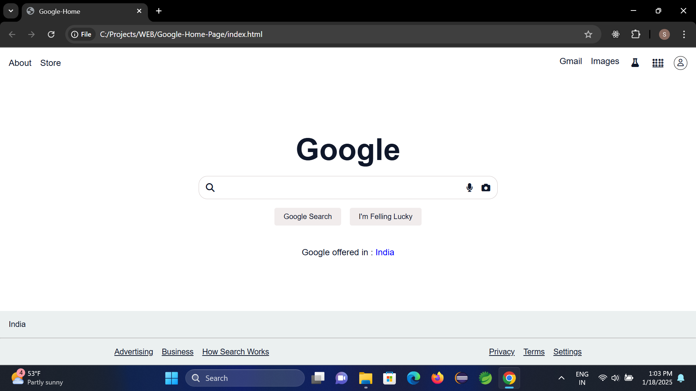

# Google Homepage Clone

This is a simple project to recreate the Google homepage using HTML, CSS, and JavaScript. The goal is to practice front-end development skills and understand basic web design principles.

## Screenshot



## Features

- Responsive design to adjust to different screen sizes.
- Search bar with a placeholder for user input.
- Links to Google's services in the footer.
- Hover effects for interactive elements.

## Technologies Used

- **HTML**: Structure of the webpage.
- **CSS**: Styling and layout.

## How to Run the Project

1. Clone the repository:
   ```bash
   git clone https://github.com/your-username/google-homepage-clone.git

